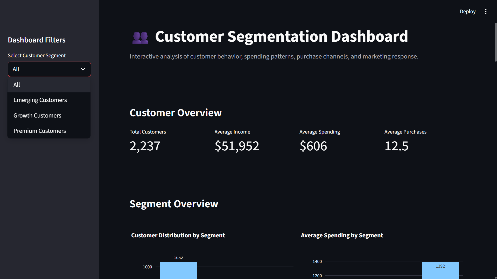
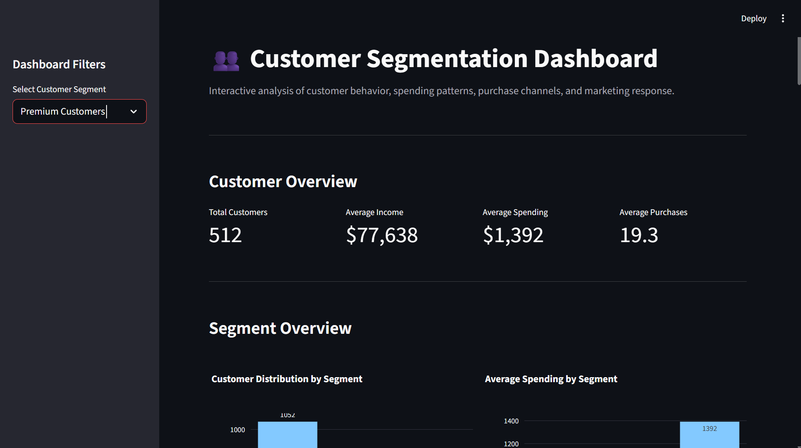

# Customer Segmentation Project

## 📌 Project Overview

This project performs customer segmentation using **Machine Learning and
K-Means Clustering**. The goal is to identify groups of customers with
similar purchasing behavior, spending patterns, income levels, and
engagement characteristics.

The project combines data inspection, cleaning, feature engineering,
clustering, evaluation, visualization, and an interactive **Streamlit
dashboard**.

------------------------------------------------------------------------

## 🎯 Objective

The main objectives are to:

-   Analyze customer demographics and purchasing behavior.
-   Identify meaningful customer groups using clustering.
-   Evaluate different cluster counts using the **Elbow Method** and
    **Silhouette Score**.
-   Profile the characteristics of each customer segment.
-   Understand product preferences and purchase channels.
-   Analyze campaign response across customer segments.
-   Present the results through an interactive dashboard.

------------------------------------------------------------------------

## 🔄 Project Workflow

``` text
Raw Customer Data
       ↓
Data Inspection
       ↓
Data Quality Analysis
       ↓
Data Cleaning & Preprocessing
       ↓
Feature Engineering
       ↓
Feature Standardization
       ↓
Optimal K Evaluation
       ↓
K-Means Clustering
       ↓
PCA Visualization
       ↓
Segment Labeling
       ↓
Streamlit Dashboard
```

------------------------------------------------------------------------

## 🧠 Machine Learning

### Algorithm

**K-Means Clustering**

K-Means clustering was used to group customers based on similarities in
their behavioral and demographic features.

The workflow included:

-   Feature selection
-   Feature standardization
-   Testing multiple values of K
-   Elbow curve analysis
-   Silhouette score evaluation
-   Final K-Means model
-   Cluster assignment
-   Customer segment profiling

### Final Model

The final segmentation uses **3 clusters**, interpreted and assigned
business-oriented labels:

-   **Emerging Customers**
-   **Growth Customers**
-   **Premium Customers**

These labels make the machine-learning results easier to understand from
a business and marketing perspective.

### PCA Visualization

Principal Component Analysis (PCA) was used to reduce the clustering
feature space to two dimensions for visualizing the customer groups.

------------------------------------------------------------------------

## 👥 Customer Segments

### 🌱 Emerging Customers

Customers with relatively low spending and purchasing activity.

**Recommended strategy:** - Convert browsing activity into purchases. -
Use entry-level promotions and product bundles. - Provide personalized
recommendations. - Experiment with targeted digital campaigns.

### 📈 Growth Customers

Customers showing stronger purchasing activity and potential for
higher-value engagement.

**Recommended strategy:** - Encourage movement toward premium purchasing
behavior. - Use cross-selling and upselling strategies. - Introduce
loyalty incentives. - Recommend premium products based on purchasing
history.

### 💎 Premium Customers

High-value customers with comparatively high income, spending, and
purchase activity.

**Recommended strategy:** - Prioritize retention and loyalty programs. -
Provide premium and personalized offers. - Use cross-selling and
high-value product recommendations. - Reward strong campaign engagement.

------------------------------------------------------------------------

## 📊 Interactive Dashboard

The Streamlit dashboard provides an interactive view of customer
behavior and segment characteristics.

### Customer Overview

The dashboard displays:

-   Total Customers
-   Average Income
-   Average Spending
-   Average Purchases

### Segment Analysis

The dashboard includes:

-   Customer distribution by segment
-   Average spending by segment
-   Income vs. total spending
-   Purchases by channel
-   Product-category spending
-   Campaign response rate

### Interactive Filtering

Users can select:

-   All Customers
-   Emerging Customers
-   Growth Customers
-   Premium Customers

Selecting a segment updates the dashboard metrics and visualizations and
provides a detailed segment profile with recommended marketing
strategies.

------------------------------------------------------------------------

## 🖥️ Dashboard Screenshots

### Overall Customer Dashboard



### Premium Customer Analysis



------------------------------------------------------------------------

## 📁 Project Structure

``` text
Customer Segmentation Project/
│
├── dataset/
├── outputs/
├── app.py
├── data_quality.py
├── eda.py
├── evaluate_clusters.py
├── feature_engineering.py
├── final_clustering.py
├── find_optimal_k.py
├── inspect_data.py
├── pca_visualization.py
├── preprocess_data.py
├── segment_labeling.py
├── requirements.txt
├── .gitignore
└── README.md
```

------------------------------------------------------------------------

## 🛠️ Technologies Used

-   **Python**
-   **Pandas** - data manipulation and analysis
-   **NumPy** - numerical operations
-   **Scikit-learn** - preprocessing, K-Means clustering, PCA, and
    evaluation
-   **Matplotlib / Seaborn** - data visualization
-   **Plotly** - interactive dashboard charts
-   **Streamlit** - interactive web dashboard

------------------------------------------------------------------------

## ▶️ Running the Project

### 1. Clone the repository

``` bash
git clone https://github.com/YogyaSrivastava134/Customer-Segmentation-Project.git
cd "Customer-Segmentation-Project"
```

### 2. Install dependencies

``` bash
pip install -r requirements.txt
```

### 3. Run the Streamlit dashboard

``` bash
streamlit run app.py
```

The dashboard will open in your browser.

------------------------------------------------------------------------

## 📌 Key Results

The project successfully:

-   Processed and cleaned customer data.
-   Engineered features suitable for clustering.
-   Standardized the clustering variables.
-   Evaluated multiple cluster counts.
-   Applied K-Means clustering.
-   Used PCA for cluster visualization.
-   Created three interpretable customer segments.
-   Built an interactive Streamlit dashboard.
-   Added segment-specific business recommendations.

The final dashboard connects machine-learning-based customer
segmentation with actionable marketing strategies.

------------------------------------------------------------------------

## 🚀 Future Improvements

Possible extensions include:

-   Testing additional clustering algorithms such as DBSCAN or
    Hierarchical Clustering.
-   Adding customer lifetime value analysis.
-   Incorporating time-based purchasing trends.
-   Adding predictive models for customer churn.
-   Deploying the Streamlit dashboard publicly.
-   Adding automated marketing recommendations based on customer
    segments.

------------------------------------------------------------------------

## 👨‍💻 Project Information

**Project:** Customer Segmentation Project\
**Technique:** K-Means Clustering\
**Application:** Customer Analytics & Marketing Segmentation\
**Dashboard:** Streamlit\
**Language:** Python
